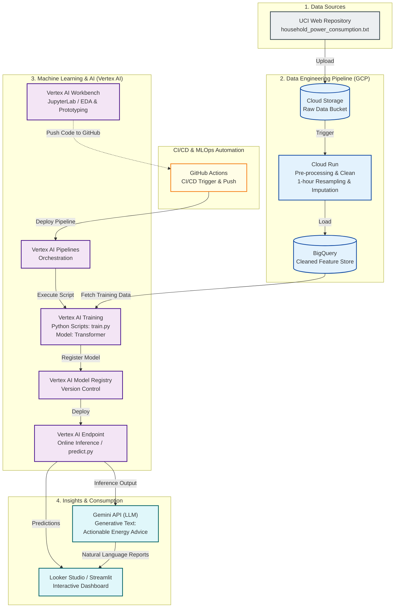

# household_analysis
過去の消費電力と気象データから、「翌24時間の消費電力」を予測します。

# Household Electricity Consumption Multi-Step Forecasting System

## 1. プロジェクト概要
- **目的:** 過去の電力消費量データから、未来の複数コマ（例: 24時間先まで）の消費量を予測し、Gemini APIを用いて最適な省エネアクションを提案する。
- **背景:** 伝統的な時系列モデル（ARIMA等）では捉えきれない長期依存関係をLSTM/Transformerでモデル化。

## 2. システム構成図（Architecture）

- データの収集(Ingest) -> 蓄積(Store) -> 変換(Transform) -> 学習/予測(ML) -> 意思決定(LLM)の流れを説明。

## 3. 技術スタック（Tech Stack）
- **言語:** Python 3.12+
- **データ基盤・加工:** Pandas / BigQuery
- **モデリング:** PyTorch (LSTM, Transformer)
- **LLM統合:** Gemini API (google-genai)
- **環境構築:** Docker / Docker Compose (予定)

## 4. データパイプライン & 特徴量エンジニアリング
- 使用データ: UCI Individual household electric power consumption dataset
- 実装した特徴量:
  - 時間ベース: 曜日、時間、週末
  - ラグ変数: $t-1$, $t-24$ などの過去の消費量
  - ローリング特徴量: 過去24時間の移動平均、移動標準偏差

## 5. モデル評価（Evaluation）
- 予測ホライズン: 未来Nステップ（例: 24時間）
- 評価指標の比較テーブル:
  | Model | MSE |
  | :--- | :--- |
  | Baseline (Last Value) | 0.XX |
  | LSTM | 0.XX |
  | Transformer | **0.XX** |

## 6. Gemini APIによるアドバイス生成の例
- 予測された値をもとに、Geminiがどのような「インサイト」や「アクションプラン」を出力したかのサンプルログを掲載。
